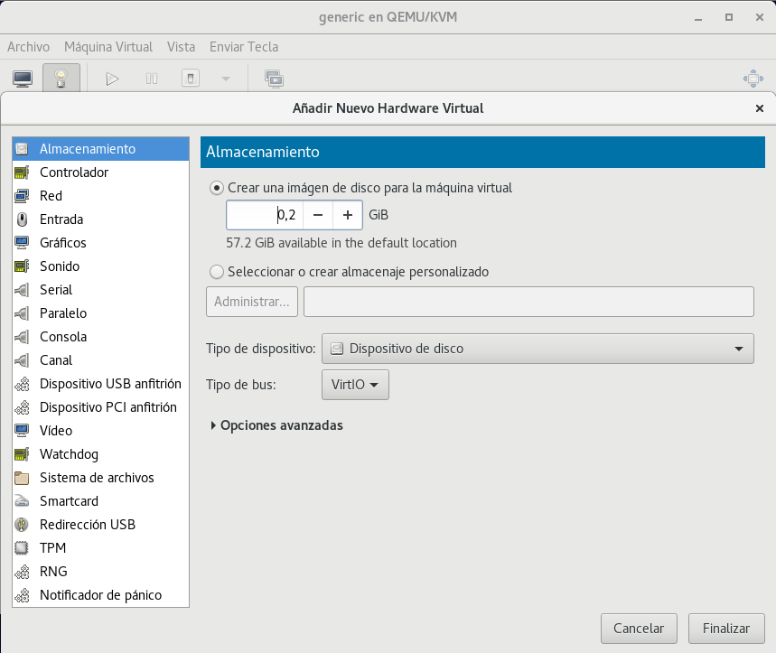
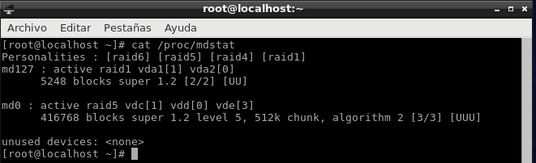

# Gestió de Volums Lògics


*  ##### **Descripció del que són**

    La gestió de volums lògics és un sistema de particions independents que porporciona més ventatges que el sistema de         particions.(com poder afegir més funcionalitats i més fàcil d'ampliar o disminuir particions).
    
*  ##### **Què volen dir les sigles, definició, analogies i exemples de comandes (explicant què fan) vistes a classe de:**
    ```
    PV -->Physical Volume - Identificació de discs
    Comandes --> 
    pvs: Llista tots els dispositius.
    pv_free: Espai lliure del volum físic
    
    VG --> Volume Group - Discs Virtuals
    Comandes --> 
    vg_name: El nom de grup de volums
    vg_sysid: ID del sistema de LVM1 
    
    LV --> Logical Volume - Particions
    Comandes --> 
    lv_size: El tamaño del volumen lógico 
    lv_name: El nombre del volumen lógico 
    ```    
    
* ##### **Entorn de pràctiques: Explicar com farem la pràctica detalladament (màquina virtual i afegir tres discs de 200M)**

    Iniciar la màquina virtual i on esta la bombeta        anar a la opció de add hardware i afegir 3 discs de     200M format **VirtIO**
                                            

* ##### **Pràctica 1: Creació d'un volum lògic a partir d'un dels tres discs durs (vda per exemple). Aquest volum lògic ha de ser del total de capacitat del disc. El volum de grup s'ha de dir practica1 i el volum lògic dades.**

        Volum lògic --> vgcreate practica1 /dev/vda 

        Volum lògic del total de capcitat del disc --> lvcreate -l 100%FREE -n dades practica1 


* ##### **Pràctica 2: Creació d'un sistema de fitxers xfs al volum lògic creat i muntatge a /mnt. També s'ha de crear un fitxer amb dd de 180MB.**

        Creació d'un sistema de fitxers --> mkfs.ext4 /dev/practica1/dades /mnt  
    
        Creació d'un fitxer amb dd de 180MB --> dd if=/dev/zero of=test.img bs=1k count=180000


* ##### **Pràctica 3: Creació d'un RAID 1 als dos discos sobrants (vdb i vdc per exemple).**
    
        Creació d'un raid 1 --> mdadm --create md1 --level=1 --raid-devices=2 /dev/vdb /dev/vdc
        
        Para saber el estado del raid --> cat /proc/mdstat
        


* ##### **Pràctica 4: Ampliació del volum lògic de dades al raid.**

        Comandament de l'ampliació (50M) --> lvextend -L+50M /dev/practica1/dades


* ##### **Pràctica 5: Ampliació del sistema de fitxers xfs al tamany actual del volum lògic dades (s'ha de poder fer sense desmuntar-lo de /mnt ja que és xfs). Una vegada creat crearem un nou fitxer de 180M.**

        Ampliació del sistema de fitxers xfs --> xfs_growfs /dev/practica1/dades
    
        Creació de un nou fitxer de 180M --> dd if=/dev/zero of=test.img bs=1k count=180000


